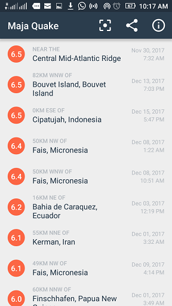
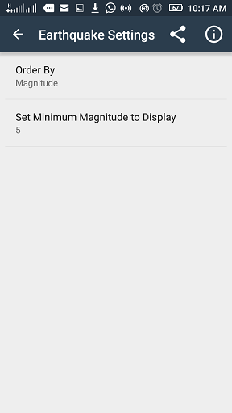
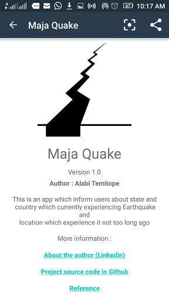
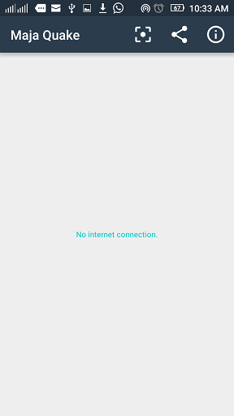

Maja Quake App
===================================
This is an app which inform users about state and country which currently 
experiencing Earthquake and location which experiencing presently.
Its data source is from the U.S. Geological Survey (USGS) organization.

Used in a Udacity course in the Beginning Android Nanodegree.

More info on the USGS Earthquake API available at:
https://earthquake.usgs.gov/fdsnws/event/1/

Pre-requisites
--------------

- Android SDK v23
- Android Build Tools v23.0.2
- Android Support Repository v23.3.0

------------------------------------------
# Classes
This project have 7 java classes
1. AboutActivity
2. EarthquakeActivity
3. EarthquakeLoader
4. Quake
5. QuakeAdapter
6. QueryUtils
7. SettingsActivity

# Layouts
This project have 4 major Layouts
1. About Layout
2. Earthquake Layout
3. List Item Layout
4. Settings Layout

# Click on Google Drive Icon Below to download apk

# Screenshots
&nbsp;
&nbsp;
&nbsp;
&nbsp;

# Author : Alabi Temitope 

Support
-------

- Google+ Community: https://plus.google.com/communities/105153134372062985968
- Stack Overflow: http://stackoverflow.com/questions/tagged/android

Patches are encouraged, and may be submitted by forking this project and
submitting a pull request through GitHub. Please see CONTRIBUTING.md for more details.

License
-------

Copyright 2016 The Android Open Source Project, Inc.

Licensed to the Apache Software Foundation (ASF) under one or more contributor
license agreements.  See the NOTICE file distributed with this work for
additional information regarding copyright ownership.  The ASF licenses this
file to you under the Apache License, Version 2.0 (the "License"); you may not
use this file except in compliance with the License.  You may obtain a copy of
the License at

http://www.apache.org/licenses/LICENSE-2.0

Unless required by applicable law or agreed to in writing, software
distributed under the License is distributed on an "AS IS" BASIS, WITHOUT
WARRANTIES OR CONDITIONS OF ANY KIND, either express or implied.  See the
License for the specific language governing permissions and limitations under
the License.
